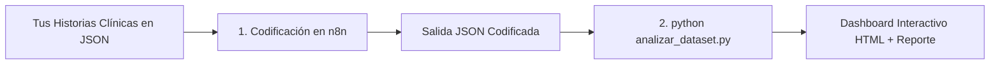

# Codificación Automatizada de Historias Clínicas a la CIF mediante LLMs y Flujos Orquestados

[](https://www.python.org/)
[](https://www.r-project.org/)
[](https://n8n.io/)
[](https://docs.docker.com/compose/)
[](https://opensource.org/licenses/MIT)

Pipeline integral para la **extracción, codificación y validación diagnóstica de texto clínico no estructurado a la Clasificación Internacional del Funcionamiento, de la Discapacidad y de la Salud (CIF)** de la OMS mediante LLMs y algoritmos de consenso estricto.

Validado sobre el **Core Set Abreviado de Dolor Crónico Generalizado** (24 categorías CIF ontológicamente consolidadas).

---

## ⚡ Guía Rápida de Uso (Quickstart)

El repositorio está diseñado tanto para **analizar cualquier base de datos externa** como para **reproducir la memoria científica del TFM**:



### 1. Analizar tu Propia Base de Datos (1 solo paso)
Una vez que hayas codificado tus historias en n8n (o usando cualquier archivo de prueba en `data/test_data/`):

```bash
# Auto-detecta si tienes o no Gold Standard:
python analizar_dataset.py ruta/a/tu_archivo_n8n.json --nombre "Mi Estudio Clínico 2026"
```

* **Si tu archivo contiene etiquetas reales (`icf_codes`):** El sistema calcula métricas de validación ($F_1$-Score, Exact Match, Precisión, Sensibilidad, Matrices de Confusión) y auditoría caso por caso (TP, FP, FN).
* **Si tu archivo solo contiene notas clínicas:** El sistema calcula métricas descriptivas (total de códigos extraídos, ranking de patologías más frecuentes, capítulos CIF afectados y % de acuerdo del consenso 3/3).

---

### 2. Reproducir el Análisis Científico Completo del TFM
Para ejecutar la batería completa de 20 módulos estadísticos, figuras en 300 DPI y tablas Word en formato editorial APA:

#### Opción A: Con Docker (Recomendado - Cero Instalación previa)
```bash
cd infrastructure
docker compose run --rm analysis
```

#### Opción B: En Local (Python 3.10+ y R 4.0+)
```bash
# 1. Crear y activar entorno virtual de Python
python3 -m venv .venv
source .venv/bin/activate  # En Windows (PowerShell): .venv\Scripts\Activate.ps1

# 2. Instalar dependencias de Python
pip install -r requirements.txt

# 3. Instalar librerías de R para tablas editoriales APA en Word (.docx)
Rscript -e "install.packages(c('flextable', 'officer', 'dplyr', 'jsonlite', 'readr', 'magrittr', 'tibble'), repos='https://cloud.r-project.org')"

# 4. Ejecutar el orquestador maestro
python scripts/analysis/ejecutar_todo.py
```

---

## 🖥️ Dashboard Interactivo y Reporte Ejecutivo

Tras la ejecución, dispones de una interfaz interactiva de archivo único lista para abrir en cualquier navegador con doble clic:
* **Dashboard HTML Autónomo:** [`results/TFL/dashboard_resumen.html`](file:///Ubuntu/home/miguelvime/projects/2026-03-11_TFM/results/TFL/dashboard_resumen.html) *(Scorecards de KPIs, gráficos comparativos interactivos, tabla completa de datos y auditor de historias caso por caso)*.
* **Informe Resumido Markdown:** [`results/TFL/informes/INFORME_EJECUTIVO_METRICAS.md`](file:///Ubuntu/home/miguelvime/projects/2026-03-11_TFM/results/TFL/informes/INFORME_EJECUTIVO_METRICAS.md).

---

## 🚀 Cómo Codificar Historias Clínicas con el LLM en n8n

### 1. Formato del Archivo de Entrada
El flujo en n8n toma como entrada un archivo JSON con historias clínicas (puedes probar directamente con `data/test_data/test_generator_output.json` o el corpus completo `data/generator_output.json`):

```json
[
  {
    "id_code_combination": "011",
    "id_clinical_text": "011_1",
    "clinical_text": "Varón de 45 años, operario de almacén, acude por dolor generalizado en espalda y extremidades. En tto. con analgésicos pautados sin mejoría. Dificultades para levantar cajas pesadas en el trabajo..."
  }
]
```

### 2. Configurar el LLM y Ejecutar en n8n
1. Levanta n8n con Docker (`cd infrastructure && docker compose up -d n8n`) y ábrelo en `http://localhost:5679`.
2. Importa el flujo correspondiente según el modelo a evaluar (en `n8n_workflows/`):
   * **Gemini Flash 3.7 (Cloud)**: `n8n_workflows/2026-08-25-gemini-3.7-flash-codifier.json`
   * **Gemini Flash 3.5 (Cloud)**: `n8n_workflows/2026-08-25-gemini-3.5-flash-codifier.json`
   * **Gemma-4-31B-it (Local)**: `n8n_workflows/2026-08-25-gemma-4-31b-it-codifier.json`
   * *(Opcional / Genérico)*: `n8n_workflows/2026-08-16_generic_LLM_codifier.json`
3. Configura tus credenciales o proveedor:
   * **Google Gemini (Cloud)**: Pega tu API Key de [Google AI Studio](https://aistudio.google.com/).
   * **Ollama / Gemma (Local On-Premise)**: Si usas Ollama local (`ollama run gemma2:27b`), introduce en la URL `http://host.docker.internal:11434` (si usas Docker) o `http://localhost:11434`.
4. Carga tu archivo JSON y pulsa **Execute Workflow**.

### 3. Salida Generada por n8n
El flujo ejecuta 3 iteraciones independientes y aplica el algoritmo de consenso estricto (`strict 3/3`), produciendo un JSON codificado:

```json
[
  {
    "id_code_combination": "011",
    "id_clinical_text": "011_1",
    "clinical_text": "Varón de 45 años, operario de almacén...",
    "predicted_icf_codes_consensus": [
      "b280",
      "d430",
      "d850",
      "e1101"
    ],
    "consensus_criteria": "strict 3/3",
    "predicted_icf_it1": ["b280", "d430", "d850", "e1101"],
    "predicted_icf_it2": ["b280", "d430", "d850", "e1101"],
    "predicted_icf_it3": ["b280", "d430", "d850", "e1101"]
  }
]
```

---

## 🗂️ Estructura del Repositorio

```
2026-03-11_TFM/
├── analizar_dataset.py           # 🚀 Analizador universal en 1 paso para cualquier archivo JSON
├── infrastructure/               # Docker Compose y Dockerfile (n8n + analysis)
├── data/                         # Datasets de entrada y referencias ontológicas
│   ├── test_data/                # Datos de prueba para validación inmediata
│   ├── generator_input.json      # Combinaciones CIF generadoras
│   ├── generator_output.json     # Corpus sintético in-silico (N=114 historias clínicas)
│   ├── physio_created_annotated.json # Gold Standard clínico humano (N=21 historias, 4 fisioterapeutas)
│   └── RAG_documents/            # Ontología CIF oficial de la OMS
├── n8n_workflows/                # Flujos de trabajo exportados de n8n
│   ├── 2026-07-28_generator_no_rag.json       # Generador de historias clínicas
│   ├── 2026-08-25-gemini-3.7-flash-codifier.json # Codificador Gemini Flash 3.7
│   ├── 2026-08-25-gemini-3.5-flash-codifier.json # Codificador Gemini Flash 3.5
│   ├── 2026-08-25-gemma-4-31b-it-codifier.json   # Codificador Gemma-4-31B-it (Ollama)
│   └── 2026-08-16_generic_LLM_codifier.json   # Codificador agnóstico de modelo
├── prompts/                      # Prompts clínicos versionados (codifier y generator)
├── scripts/                      # Código ejecutable
│   ├── codifier/                 # Scripts JS del nodo de consenso en n8n
│   ├── generator/                # Scripts JS del generador en n8n
│   ├── generate_tripod_table.R   # Generador de tabla TRIPOD-LLM en Word (.docx)
│   └── analysis/                 # 20 scripts de análisis estadístico + ejecutar_todo.py
└── results/                      # Resultados y artefactos de publicación
    ├── llm_text/                 # Predicciones de los 3 modelos LLM (corpus sintético N=114)
    ├── human_text/               # Predicciones de los 3 modelos LLM (corpus humano N=21)
    └── TFL/                      # Tablas APA (.docx), Figuras 300 DPI, Informes y Dashboard HTML
```

---

## 📊 Scripts de Análisis Estadístico (`scripts/analysis/`)

El orquestador `python scripts/analysis/ejecutar_todo.py` ejecuta automáticamente la suite completa de 20 módulos:

- `ejecutar_todo.py`: Orquestador maestro que corre toda la batería estadística y renderizado de tablas.
- `01_calculo_confiabilidad_azar.py`: Fiabilidad inter-iteraciones ($\alpha$ de Krippendorff, $AC_1$ de Gwet).
- `02_calculo_acuerdo_exacto.py`: Acuerdo exacto paciente a paciente y registro de discrepancias.
- `03_calculo_f1_score.py`: Validez diagnóstica $F_1$ Micro/Macro con IC 95% Bootstrap.
- `04_calculo_sensibilidad_ablacion.py`: Sensibilidad por ablación de la clase dominante `b280`.
- `05_generar_tfl_fiabilidad.py`: Exportación de tablas TFL de fiabilidad en CSV y Excel.
- `06_plot_desempeno.py`: Generación de Figuras 1 y 2 a 300 DPI en `results/TFL/figuras/`.
- `07_plot_eficiencia_f1.py`: Figura de coste computacional vs ganancia F1.
- `08_plot_sensibilidad_ablacion.py`: Figura de sensibilidad por ablación de `b280`.
- `09_generar_tablas_apa.R`: Renderizado de tablas APA de desempeño en Word (.docx) con `flextable`.
- `10_generar_tabla_fiabilidad_apa.R` a `12_tabla_sensibilidad_ablacion_apa.R`: Tablas APA de fiabilidad, consenso y ablación en Word (.docx).
- `13_analisis_human_annotated.py` a `15_generar_tablas_human_apa.R`: Métricas diagnósticas, figuras 300 DPI y tablas Word APA sobre historias reales ($N=21$) con Gold Standard de 4 fisioterapeutas.
- `16_generar_informe_word_completo.py`: Informe clínico integrado en Word (.docx).
- `17_workflow_diagram.py`: Diagramas metodológicos del flujo (PNG/SVG/PDF en español e inglés).
- `18_generar_dashboard_html.py`: Generador del Dashboard interactivo HTML y reporte ejecutivo Markdown.
- `19_generar_tabla_caracteristicas_dataset_apa.R`: Tabla Word APA con las características métricas del dataset.
- `20_plot_caracteristicas_dataset.py`: Figuras 3, 4 y 5 de prevalencia y frecuencia relativa del dataset.

---

## 📄 Licencia

Este proyecto está bajo la Licencia MIT.
